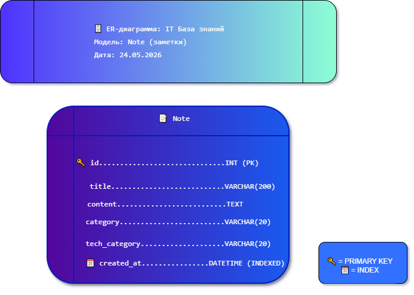

# Мой вклад в проект «IT База знаний»

## Что я сделал:

- ✅ Написал юнит-тесты для проверки CRUD-операций (`myapp/tests.py`)
- ✅ Добавил систему тегов для материалов (`tech_category` в модели Note)
- ✅ Настроил индекс базы данных для оптимизации запросов по дате (`created_at`)
- ✅ Участвовал в настройке прав sudo пользователей
- ✅ Провёл ручное тестирование всех маршрутов и форм
- ✅ Составил ER-диаграмму базы данных (файл `er_diagram.drawio.png`)

 - Add my contribution
